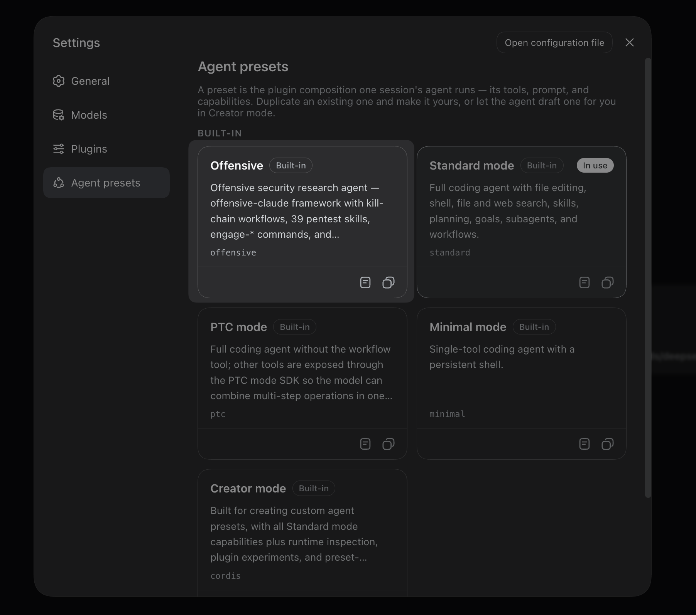
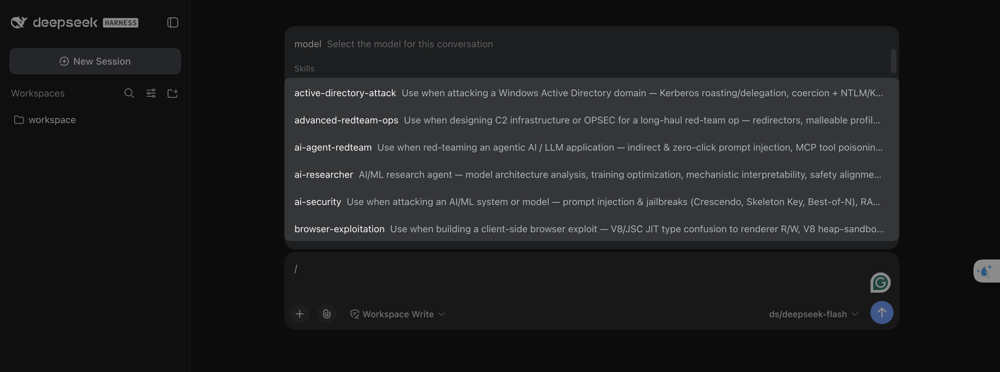

# dsh-offensive

A [DeepSeek Harness](https://github.com/deepseek-ai/deepseek-harness) (dsh) bundle that ports
[offensive-claude](https://github.com/hypnguyen1209/offensive-claude) — a spec-driven offensive
security framework — into dsh as a self-contained plugin.

**Authorized security testing only.** See [TERMS.md](TERMS.md).

## What you get

- **Offensive agent preset** — appears in the preset picker; an attacker-perspective persona
  with kill-chain engagement flow, scope/finding/OPSEC discipline.
- **39 skills** (recon-osint, web-pentest, exploit-development, active-directory-attack,
  cloud-security, ...) loadable via the `skill` tool, plus 8 agent playbooks.
- **18 engagement commands** — `/engage-init`, `/engage-scope`, `/engage-recon`, ...,
  `/engage-report` (Claude Code's `engage.*` commands, converted).
- **SessionStart / SubagentStart hooks** injecting the framework's skill-invocation
  dispatcher.
- The framework's Python tooling (`engine/`, `skills/*/scripts/`, templates, workflows).

## Install

```bash
dsh plugin --profile web add https://github.com/p4-labs/dsh-offensive/releases/latest/download/dsh-offensive.tar.gz
```

Restart dsh, create a new session, and pick the **Offensive** preset.

The URL above always points to the latest release. To pin a specific version, visit the [Releases](https://github.com/p4-labs/dsh-offensive/releases) page.

## Demo

<p align="center">
  
</p>

After selecting the preset, all framework skills are available through the skill catalog:

<p align="center">
  
</p>

## Layout

```
modes/offensive/            framework root (self-contained)
├── preset.yml              preset manifest
├── agent.cordis.yml        preset composition
├── home/AGENTS.md          workspace instructions (scoped to this preset)
├── hooks/                  SessionStart/SubagentStart dispatcher hooks
├── skills/                 39 skill bundles + 8 agents + 18 engage-* commands
└── engine/ templates/ workflows/ presets/ TERMS.md
lib/index.js                bundle entry: registers the preset root and mounts hooks
```

## Credits

All framework content © [hypnguyen1209/offensive-claude](https://github.com/hypnguyen1209/offensive-claude) (MIT).
